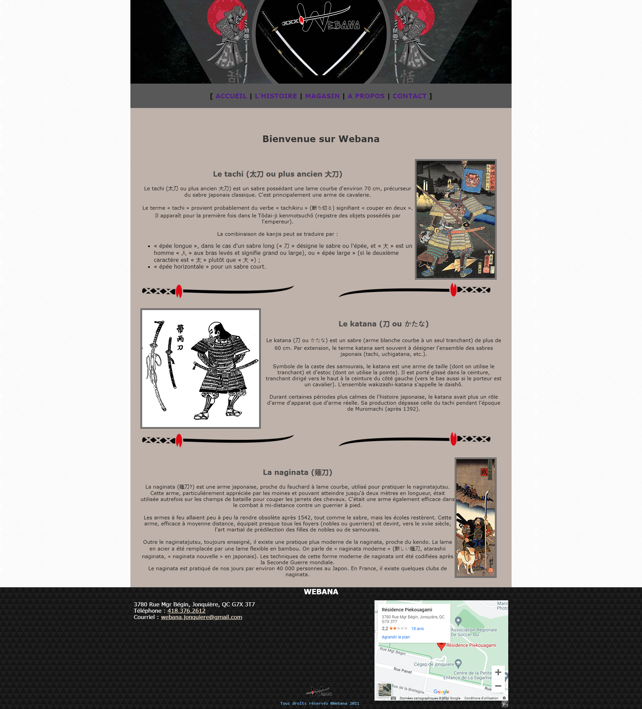

# Webana - Refonte d'un Site sur l'Histoire des Katanas

## Description du projet
Ce projet est une [refonte](# "Cliquez pour voir l'image") d'un ancien site web que j'ai créé en début de première année en intégration multimédia, portant sur l'histoire des katanas. L'objectif est de moderniser l'apparence et la fonctionnalité du site en utilisant des technologies web actuelles comme HTML, CSS, JavaScript, Bootstrap, et jQuery.

Cliquez pour voir l'image de l'ancienne version du projet

  

### Objectifs
- Moderniser l'apparence et les fonctionnalités du site original.
- Utiliser des technologies web modernes pour améliorer l'expérience utilisateur et la maintenabilité du code.

## Structure du projet
- `index.html` : La page d'accueil présentant l'histoire des katanas.
- `styles.css` : Les styles CSS générés à partir des fichiers SCSS.
- `main.js` : Le script JavaScript pour les interactions dynamiques.
- `images/` : Contient les images utilisées sur le site, y compris un screenshot de l'ancien site (`webana.png`).

## Technologies utilisées
- HTML5
- CSS3 (SCSS pour la gestion des styles)
- JavaScript (jQuery pour les interactions dynamiques)
- Bootstrap pour le responsive design et les composants UI.

## Déploiement
Le projet sera déployé sur GitHub Pages pour une accessibilité en ligne. 

## Contribution
Ce projet est développé exclusivement par **Christen Dijoux**.

## Licence
Ce projet est libre d'utilisation. Vous êtes invités à explorer et à apprendre de ce code.

---

N'hésitez pas à parcourir et à contribuer à ce projet pour découvrir l'histoire fascinante des katanas et les techniques de développement web modernes utilisées pour sa création.

Ce projet a été réalisé par Christen Dijoux.
